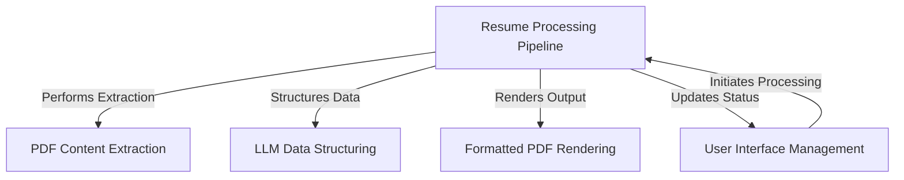
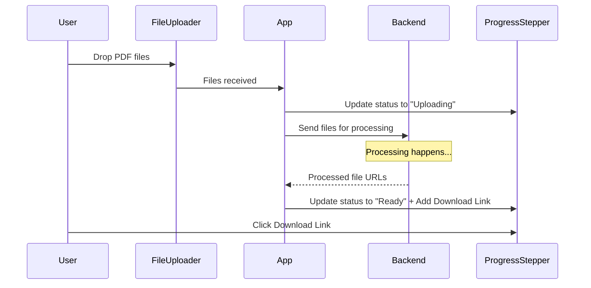
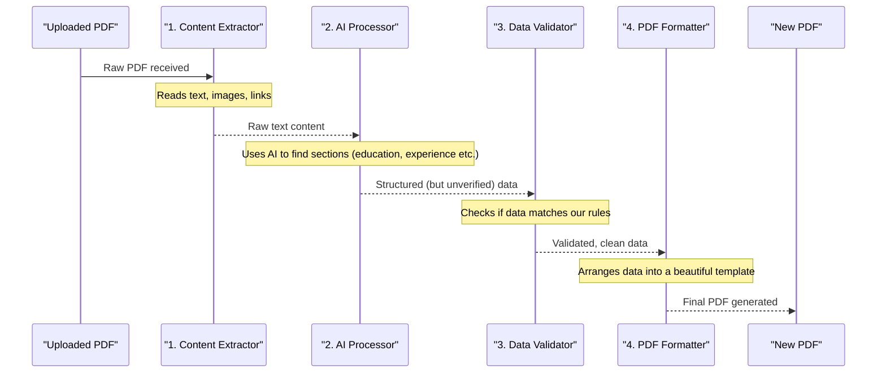
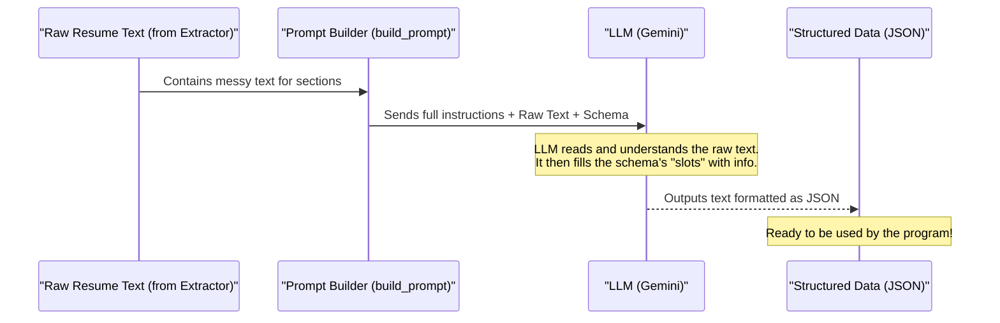
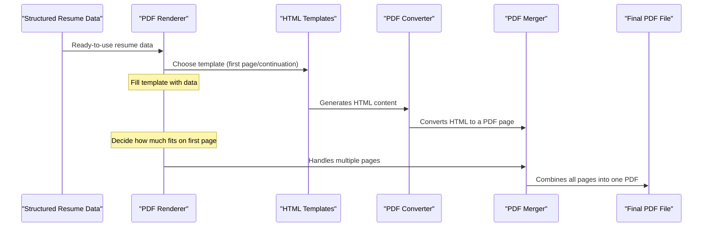

# Tutorial: Resume-Consolidator

The Resume Consolidator is an application that **automates** the process of transforming raw resume PDFs into a *standardized*, *structured* format and then rendering them into new, professionally *formatted* PDFs. It acts like a digital assembly line, where users upload their resumes, an AI intelligently extracts and organizes the information, and a polished PDF is generated for download.


## Visual Overview



## Chapters

1. [User Interface Management
](01_user_interface_management_.md)
2. [Resume Processing Pipeline
](02_resume_processing_pipeline_.md)
3. [PDF Content Extraction
](03_pdf_content_extraction_.md)
4. [LLM Data Structuring
](04_llm_data_structuring_.md)
5. [Formatted PDF Rendering
](05_formatted_pdf_rendering_.md)

---
# Chapter 1: User Interface Management

Imagine you have a stack of 50 resumes, all in separate PDF files. Your boss asks you to combine them all into one big, easy-to-read PDF, perhaps even formatted nicely. Doing this by hand would be a nightmare! This is where `Resume-Consolidator` comes in. But how do you *tell* the program what to do? How do you give it your files? How do you know when it's done?

This is exactly what **User Interface Management** is all about. It's the "face" of our application, the part you interact with directly. Think of it like the dashboard in a car: it has buttons (to start/stop), indicators (like speed or fuel), and lights (like "check engine"). The User Interface (UI) for `Resume-Consolidator` gives you the "buttons" to upload your files, the "indicators" to see the progress, and the "lights" to tell you when your consolidated PDF is ready to download.

The core problem User Interface Management solves is making complex tasks simple and accessible to you, the user.

## How You Use the Resume-Consolidator

Let's walk through the simple steps of using `Resume-Consolidator` to achieve our goal of combining resumes:

1.  **You Provide Files**: You drag and drop your resume PDF files onto the application window, or click a button to select them. This is like putting letters into a mailbox.
2.  **See Progress**: As the application starts working, you'll see updates for each file, like "Uploading," "Processing," and "Ready." This is like checking the status of your mailed letter.
3.  **Download Result**: Once a resume is processed and formatted, you get a direct link to download the new, improved PDF. This is like receiving your special delivery!

It's a straightforward process, thanks to good UI management!

## Under the Hood: How the User Interface Works

When you interact with the `Resume-Consolidator`'s UI, a lot happens behind the scenes to make it feel smooth. Let's trace what happens when you upload a file.

Imagine you're at a special "Digital Post Office":

1.  **You (The User)**: You gather your PDF resumes and drop them into a special "inbox" (the file uploader).
2.  **The Inbox (FileUploader)**: It immediately recognizes the files and tells the main "Post Office Desk" (the App).
3.  **The Post Office Desk (App)**: It writes down the names of your files and temporarily marks them as "Uploading." Then, it packages your files into a digital envelope and sends them off to the "Processing Department" (the Backend Server).
4.  **The Processing Department (Backend Server)**: This is where the real work of combining and formatting happens. It takes a little time.
5.  **Status Board (ProgressStepper)**: While all this is happening, the Post Office Desk constantly updates a public "Status Board" so you can see if your files are still "Uploading," "Processing," or finally "Ready" for pickup.
6.  **Pickup (Download Link)**: Once the Processing Department is done, it sends back a "Ready" signal and a "pickup address" for your new consolidated PDF. The Post Office Desk then puts this pickup address on the Status Board as a "Download" button.

Here's a simplified sequence of events using a diagram:



## Looking at the Code for the User Interface

Let's see how this "digital post office" is built in the code.

The main control center for our User Interface is the `App.jsx` file. It brings together all the different UI pieces.

```javascript
// frontend/src/App.jsx
import React, { useState } from "react";
import FileUploader from "./components/FileUploader";
import ProgressStepper from "./components/ProgressStepper";
import Loader from "./components/Loader";

export default function App() {
  const [progress, setProgress] = useState([]);    // Holds status of each file
  const [loading, setLoading] = useState(false);   // Is the app busy?

  // ... (handleUpload function explained below)

  return (
    <div className="ui-container relative">
      {loading && <Loader />} {/* Shows spinning circles when busy */}

      <h1 className="ui-heading">Resume Consolidator</h1>
      <br /><br />
      <FileUploader onUpload={handleUpload} /> {/* This is where you drop files */}

      <ProgressStepper steps={progress} /> {/* This shows file status */}
    </div>
  );
}
```
In this `App.jsx` file:
*   `useState` is like a notepad where the app remembers things, such as `progress` (the status of each file) and `loading` (if it's busy).
*   `FileUploader` is the component (a reusable piece of UI) that handles getting your files.
*   `ProgressStepper` is another component that shows the progress of each file.
*   `Loader` is a simple visual element that tells you the app is working.

Now, let's look at the `FileUploader.jsx` component, which is your "inbox" for files:

```javascript
// frontend/src/components/FileUploader.jsx
import React, { useCallback } from "react";

export default function FileUploader({ onUpload }) {
  const onFileChange = useCallback((e) => {
    const files = Array.from(e.target.files);
    onUpload(files); // Tells the main App that files are ready
  }, [onUpload]);

  return (
    <form className="file-upload-form ui-uploader">
      <label htmlFor="file" className="file-upload-label">
        {/* ... (SVG icon and text for drag/drop area are here) ... */}
        <input
          id="file"
          type="file"
          multiple // Allows selecting many files at once
          onChange={onFileChange} // Calls onFileChange when you pick files
        />
      </label>
    </form>
  );
}
```
The `FileUploader`:
*   Provides a visual area where you can drag and drop files.
*   The hidden `<input type="file" multiple />` is the actual magic that lets your browser pick files.
*   When files are selected, the `onFileChange` function gathers them and then calls `onUpload`. This `onUpload` is a special message sent back to the `App.jsx` component, saying, "Hey, I've got files for you!"

Back in `App.jsx`, the `handleUpload` function is like the "Post Office Desk" that receives the files from the `FileUploader` and sends them off to the backend server:

```javascript
// frontend/src/App.jsx (inside the App component)
// ... (imports and useState declarations) ...

  const handleUpload = async (files) => {
    const formData = new FormData();
    files.forEach((file) => formData.append("files", file)); // Prepares files for sending

    setLoading(true); // Turn on the Loader animation
    // Set initial status for each file as "Uploading"
    setProgress(files.map((f) => ({ name: f.name, status: "Uploading", url: null })));

    try {
      const res = await fetch("http://localhost:8000/api/upload", {
        method: "POST",
        body: formData, // Sends the files to the server
      });
      const data = await res.json();  // Gets back processed info from server

      // Update progress with "Ready" status and download links
      const updated = data.map((item, idx) => ({
        name: files[idx].name,
        status: "Ready",
        url: `http://localhost:8000${item.pdf_url}`,
      }));
      setProgress(updated);
    } catch (err) {
      console.error("Upload failed:", err);
      // If something goes wrong, mark files as "Failed"
      setProgress(files.map((f) => ({ name: f.name, status: "Failed", url: null })));
    } finally {
      setLoading(false); // Turn off the Loader animation
    }
  };

// ... (rest of App component) ...
```
The `handleUpload` function:
*   Takes the files you provided.
*   Sets the `loading` state to `true` (which makes the `Loader` component visible).
*   Updates the `progress` state to show "Uploading" for each file.
*   Uses `fetch` to send the files to the `Resume-Consolidator`'s "brain" (the backend server) at `http://localhost:8000/api/upload`. This is where the real resume processing starts, which we'll learn more about in the [Resume Processing Pipeline](02_resume_processing_pipeline_.md) chapter.
*   Once the backend is done, it sends back information, including the new download links.
*   `handleUpload` then updates the `progress` again, setting the status to "Ready" and adding the `url` for you to download.
*   Finally, it hides the `Loader`.

And last but not least, the `ProgressStepper.jsx` component, which is your "Status Board":

```javascript
// frontend/src/components/ProgressStepper.jsx
import React from "react";

export default function ProgressStepper({ steps }) {
  return (
    <div className="ui-progress">
      {steps.map((s, idx) => ( // Goes through each file's status
        <div key={idx} className="ui-progress-item">
          <div>
            <p className="font-medium">{s.name}</p> {/* Shows file name */}
            <p className="text-sm text-gray-600">{s.status}</p> {/* Shows status (e.g., "Uploading", "Ready") */}
          </div>
          {s.url && ( // Only show download button if a URL exists
            <a
              href={s.url}
              target="_blank"
              rel="noopener noreferrer"
              className="ui-download-btn"
            >
              Download
            </a>
          )}
        </div>
      ))}
    </div>
  );
}
```
The `ProgressStepper`:
*   Receives the `steps` (our `progress` list from `App.jsx`).
*   For each file, it displays its name and current `status`.
*   If a `url` is available (meaning the file is ready), it shows a "Download" button that links directly to your new PDF.

## Conclusion

In this chapter, we explored User Interface Management, the friendly "face" of the `Resume-Consolidator` application. We learned how it provides you with simple ways to upload your files, see real-time updates on their processing, and ultimately download your consolidated PDFs. It makes the complex operations happening behind the scenes accessible and understandable.

Next, we'll dive deeper into what actually happens *after* you upload your files, specifically, the journey your resumes take through the application's "brain" for processing. Ready to follow the path? Let's go to [Chapter 2: Resume Processing Pipeline](02_resume_processing_pipeline_.md)!

---
# Chapter 2: Resume Processing Pipeline

In [Chapter 1: User Interface Management](01_user_interface_management_.md), we learned how to interact with `Resume-Consolidator`. You drag and drop your PDF files, see their status, and eventually download your beautifully formatted resumes. That's the "front door" of our digital post office.

But what happens *after* you drop your files into the "inbox" and before you get the final "special delivery"? This is where the magic happens! This chapter is all about the **Resume Processing Pipeline**.

Think of the `Resume-Consolidator` as an automated factory assembly line for resumes. When you upload a PDF, it enters this assembly line. At each "station" on the line, a specific task is performed to transform the raw, uploaded resume into a polished, standardized new PDF.

The core problem the Resume Processing Pipeline solves is taking a varied, unstructured PDF resume and converting it into a consistent, machine-readable format, and then turning *that* into a new, perfectly formatted PDF. It's like having a master chef who can take any set of ingredients and always produce the same gourmet meal.

## The Assembly Line: How a Resume is Processed

When you upload a resume PDF, it goes through several key stages, each designed to refine the data. Here are the main "stations" on our resume assembly line:

| Station Name                  | What it Does                                                              | Why it's Important                                                 |
| :---------------------------- | :------------------------------------------------------------------------ | :----------------------------------------------------------------- |
| **1. Content Extraction**     | Takes the PDF and pulls out all text, images, and links.                  | Gets the raw material from the original messy PDF.                 |
| **2. AI Data Structuring**    | Sends the raw content to an intelligent AI model to understand and organize it into categories (like education, experience, skills). | Turns jumbled text into structured, usable information.            |
| **3. Data Validation**        | Checks if the AI's organized data follows the rules we've set.            | Ensures the data is correct and complete before making the new PDF.|
| **4. PDF Rendering**          | Uses the clean, structured data to create a brand new, neatly formatted PDF. | Produces the final, polished resume that you'll download.          |

Let's follow a resume on its journey through this pipeline.



## Behind the Scenes: The Backend's Role

In [Chapter 1: User Interface Management](01_user_interface_management_.md), we saw how the `handleUpload` function in `App.jsx` sends your files to the backend server at `http://localhost:8000/api/upload`. This `upload` function in the `src/api.py` file is the control center for our resume processing pipeline. It orchestrates all the steps we just discussed.

Let's look at the key parts of the `upload` function:

First, when a file arrives, the backend saves it temporarily:

```python
# backend/src/api.py (inside the upload function)
import os, uuid

# ... (other imports and config) ...

UPLOAD_DIR = os.path.join(os.path.dirname(__file__), "..", "uploads")
os.makedirs(UPLOAD_DIR, exist_ok=True) # Makes sure the folder exists

@app.route("/api/upload", methods=["POST"])
def upload():
    files = request.files.getlist("files") # Get files from your upload
    results = []

    for f in files:
        uid = uuid.uuid4().hex # Give each file a unique ID
        in_path = os.path.join(UPLOAD_DIR, f"{uid}.pdf")
        f.save(in_path) # Save the uploaded PDF file
        # ... (rest of the pipeline happens here) ...
```
Here, `f.save(in_path)` is like our "assembly line intake" – it takes the uploaded PDF and places it in a temporary storage area (`uploads` folder) so the pipeline can start working on it. Each file gets a unique ID (`uid`) to keep things organized.

### Station 1: PDF Content Extraction

Once the PDF is saved, the first station on our assembly line extracts all the important bits: text, links, and even images. This is the focus of [Chapter 3: PDF Content Extraction](03_pdf_content_extraction_.md).

```python
# backend/src/api.py (inside the upload function, after saving the file)
from extractor import extract_text_and_links, extract_image, split_lines, debug_headings

# ... (other code) ...

# 1) extract raw sections
text, links = extract_text_and_links(in_path) # Get all text and links
img_bytes   = extract_image(in_path) or b"  " # Get any image data
lines       = split_lines(text) # Break text into individual lines
heads       = debug_headings(lines) # Find main sections (like "Education")

raw = {} # This will store raw text for each section
for _,_,key in heads:
    s,e = find_section_bounds(heads, key) # Find where sections start and end
    raw[key] = extract_section(lines, s, e) or "" # Extract text for each section
# ... (rest of the pipeline) ...
```
This part of the code uses specialized functions (like `extract_text_and_links` and `extract_image`) to pull out every piece of information from the PDF. It's like dismantling a machine to see all its individual parts. The result is `raw`, which holds the extracted text, organized by basic sections found in the resume.

### Station 2: AI Data Structuring

Next, the raw content goes to the "smart" station: an AI model. This model reads the extracted text and intelligently structures it into categories like "education," "experience," and "skills." This complex process is detailed in [Chapter 4: LLM Data Structuring](04_llm_data_structuring_.md).

```python
# backend/src/api.py (inside the upload function)
import google.generativeai as genai
import re, json
from formatter.prompt_builder import build_prompt

# ... (other code) ...

# 3) single Gemini call (Gemini is Google's AI model)
prompt = build_prompt(raw) # Prepare a question for the AI using our raw text
model  = genai.GenerativeModel(MODEL)
resp   = model.generate_content(prompt) # Ask the AI to structure the data
clean  = re.sub(r"^```json\s*|\s*```$", "", resp.text, flags=re.IGNORECASE).strip()
try:
    llm = json.loads(clean) # The AI gives us structured data in JSON format
except json.JSONDecodeError as err:
    # ... (error handling for invalid AI output) ...
    pass

# 4) merge LLM structured data into our resume structure
sec = llm["sections"]
parsed["sections"]["education"]  = sec.get("education", [])
parsed["sections"]["experience"] = sec.get("experience", [])
parsed["sections"]["skills"]     = sec.get("skills", {})
parsed["sections"]["misc"].update(sec.get("misc", {}))
# ... (rest of the pipeline) ...
```
Here, `build_prompt(raw)` creates a special instruction for the AI, asking it to identify and categorize information. The AI then processes this, and `json.loads(clean)` takes the AI's structured response (which is in a format called JSON) and turns it into something our program can use. This structured data is then stored in the `parsed` dictionary, ready for the next step.

### Station 3: Data Validation

Before we make a new PDF, we need to make sure the structured data from the AI makes sense and follows a predefined format. This "quality check" ensures that your new PDF will be perfect.

```python
# backend/src/api.py (inside the upload function)
from jsonschema import validate, ValidationError
import json

# ... (other code) ...

SCHEMA_PATH = os.path.join(os.path.dirname(__file__), "formatter", "schema.json")
with open(SCHEMA_PATH, encoding="utf-8") as f:
    SCHEMA = json.load(f) # Load the rules for our resume data

# ... (cleaning utilities to remove empty values before validation) ...

# 6) validate the structured data against our rules
validate(parsed, SCHEMA)
# ... (rest of the pipeline) ...
```
The `validate(parsed, SCHEMA)` line is crucial. It compares the `parsed` data (our AI-structured resume information) against `SCHEMA` (a blueprint of how resume data *should* look). If anything doesn't match the rules (e.g., a required field is missing, or a number is in the wrong place), it stops the process and flags an error, preventing a malformed PDF from being generated. This is like a supervisor checking the quality of parts before they go into the final product.

### Station 4: Formatted PDF Rendering

Finally, with all the validated, clean, and structured data, it's time to build the new, beautiful PDF. This process is covered in detail in [Chapter 5: Formatted PDF Rendering](05_formatted_pdf_rendering_.md).

```python
# backend/src/api.py (inside the upload function)
from formatter.pdf_renderer import render_pdf

# ... (other code) ...

# 7) render PDF
out_path = os.path.join(UPLOAD_DIR, f"{uid}-out.pdf") # Path for the new PDF
render_pdf(parsed, out_path) # Create the new PDF using the structured data

results.append({
    "id": uid,
    "file_name": f.filename,
    "pdf_url": f"/api/result/{uid}-out.pdf" # Provide a link to download
})

return jsonify(results) # Send the result back to the frontend
```
The `render_pdf(parsed, out_path)` function takes all the organized information in the `parsed` dictionary and uses it to fill in a professional resume template, creating a brand new PDF at `out_path`. This is the last step on our assembly line, producing the polished product that's ready for you to download.

## Conclusion

In this chapter, we've taken a deep dive into the **Resume Processing Pipeline**, the automated assembly line that transforms your raw PDF resumes into structured, validated, and beautifully formatted new PDFs. We followed a resume's journey through content extraction, AI structuring, data validation, and final PDF rendering.

You now understand that when you upload a file, it's not just a simple conversion; it's a multi-stage, intelligent process orchestrated by the backend server.

Next, we'll zoom in on the very first station of this pipeline: how we actually get the raw text, images, and links out of a PDF file. Ready to extract some data? Let's go to [Chapter 3: PDF Content Extraction](03_pdf_content_extraction_.md)!

---

# Chapter 3: PDF Content Extraction

In [Chapter 2: Resume Processing Pipeline](02_resume_processing_pipeline_.md), we learned about the `Resume-Consolidator`'s automated assembly line, where your uploaded PDF resumes are transformed. We saw that the very first "station" on this line is **PDF Content Extraction**.

Imagine you're handed a beautiful, printed resume. Before you can understand what's in it – the person's name, their job history, their skills – you first have to *read* it. You scan the words, look at any pictures, and notice any web links.

For a computer program, a PDF file is often just like that printed page – it knows how to display it beautifully, but it doesn't always "know" what the words mean or where the important information is located. The core problem **PDF Content Extraction** solves is enabling our `Resume-Consolidator` to "read" your PDF resume, not just display it. It's like teaching our computer to be a diligent librarian, meticulously scanning a physical resume and making detailed notes about all the information present, even if it's just an image or a link.

## What Does "Extracting Content" Mean?

When we talk about PDF Content Extraction, we're not just trying to grab *some* text. We want to be smart about it:

1.  **Pulling All Visible Text**: Every word, every sentence.
2.  **Finding Web Links**: Any clickable URLs like LinkedIn profiles or portfolio sites.
3.  **Extracting Images**: If there's a profile picture or a logo, we want that too.
4.  **Identifying Key Sections**: Trying to spot headings like "Experience," "Education," "Skills," etc.
5.  **Recognizing Contact Information**: Pinpointing the name, email address, and phone number.

This step is absolutely crucial because without it, the rest of the pipeline (like sending data to an AI) would have nothing to work with!

## How the Extractor Works in the Pipeline

Let's revisit the `upload` function in `backend/src/api.py`. After your PDF file is temporarily saved, the first big task is to extract its content:

```python
# backend/src/api.py (inside the upload function, after saving the file)
from extractor import extract_text_and_links, extract_image, split_lines, debug_headings

# ... (other code) ...

# 1) extract raw sections
text, links = extract_text_and_links(in_path) # Get all text and links
img_bytes   = extract_image(in_path) or b"  " # Get any image data
lines       = split_lines(text) # Break text into individual lines
heads       = debug_headings(lines) # Find main sections (like "Education")

raw = {} # This will store raw text for each section
for _,_,key in heads:
    s,e = find_section_bounds(heads, key) # Find where sections start and end
    raw[key] = extract_section(lines, s, e) or "" # Extract text for each section
# ... (rest of the pipeline) ...
```
This snippet is the entry point for the extraction process. It calls functions from our `extractor.py` file to perform different tasks:
*   `extract_text_and_links`: Gets the main text content and any web links.
*   `extract_image`: Looks for and extracts any embedded image (like a profile photo).
*   `split_lines`: Breaks the extracted text into individual lines, which helps with easier processing.
*   `debug_headings`: Tries to identify common resume section titles like "Experience" or "Education."
*   `find_section_bounds` and `extract_section`: Use the identified headings to grab the text belonging to each section.

The result of all these steps is the `raw` dictionary, which now holds parts of your resume organized by basic sections, along with links and image data.

## Under the Hood: The `extractor.py` File

The real "brains" of the PDF Content Extraction are located in the `backend/src/extractor.py` file. This file contains the specialized functions that know how to dig into a PDF and pull out its secrets.

Let's see the journey of your PDF data through the extractor:

```mermaid
sequenceDiagram
    participant PDF as "Your PDF Resume"
    participant Extractor as "PDF Content Extractor"
    participant TextContent as "Extracted Text"
    participant Links as "Extracted Links"
    participant ImageData as "Extracted Image"
    participant SectionHeads as "Identified Sections"
    participant ContactInfo as "Identified Contact Info"

    PDF->>Extractor: "Here's my resume!"
    Note over Extractor: Tries various ways to read PDF text
    Extractor->>TextContent: Sends all words and sentences
    Extractor->>Links: Sends web links (LinkedIn, GitHub)
    Extractor->>ImageData: Sends profile picture (if any)
    Note over Extractor: Analyzes Extracted Text
    Extractor->>SectionHeads: Finds "Experience" "Education"
    Extractor->>ContactInfo: Finds name, email, phone
```

### Getting Text from a PDF (Even Tricky Ones!)

PDFs can be tricky. Some PDFs have text directly embedded, while others might be just "pictures" of text (like a scanned document). Our `extract_text_and_links` function is smart enough to try a few methods to get the text:

```python
# backend/src/extractor.py (part of extract_text_and_links function)
import fitz # PyMuPDF library for PDFs
import pdfplumber # Another library for PDFs
import pytesseract # For reading text from images (OCR)
from PIL import Image

def extract_text_and_links(path: str) -> Tuple[str, List[str]]:
    text, links = "", set()
    doc = fitz.open(path) # Step 1: Open the PDF
    for page in doc:
        text += page.get_text() # Try to get text directly
        for link in page.get_links():
            uri = link.get("uri")
            if uri:
                links.add(uri.rstrip("/"))
    if len(text) < 50: # If first try didn't get much text
        with pdfplumber.open(path) as pdf:
            text = "\n".join(p.extract_text() or "" for p in pdf.pages) # Step 2: Try another library
    if len(text) < 50: # If still not much text
        for page in doc:
            pix = page.get_pixmap(dpi=200)
            img = Image.frombytes("RGB", [pix.width, pix.height], pix.samples)
            text += "\n" + pytesseract.image_to_string(img) # Step 3: Use OCR (Image to Text)
    return text, list(links)
```
**Explanation:**
This function is a great example of robustness.
*   First, it uses `fitz` (also known as PyMuPDF) to try and extract text and links. This is usually the fastest and most accurate method.
*   If `fitz` doesn't find much text (meaning the PDF might be an image-based scan), it then tries `pdfplumber`, another popular PDF processing library.
*   If *that* also fails, it turns to `pytesseract`. This is an **OCR (Optical Character Recognition)** tool. It converts each PDF page into an image and then "reads" the text from that image, just like a human would read a scanned document. This ensures that even "picture" resumes can be processed!

### Extracting Images

Sometimes resumes have a profile picture. The `extract_image` function finds the first image embedded in the PDF:

```python
# backend/src/extractor.py (extract_image function)
def extract_image(path: str) -> Optional[bytes]:
    doc = fitz.open(path)
    for page in doc:
        for img_ref in page.get_images(full=True):
            xref = img_ref[0]
            img_dict = doc.extract_image(xref)
            if img_dict and "image" in img_dict:
                return img_dict["image"] # Returns the image data in bytes
    return None
```
**Explanation:** This function iterates through each page of the PDF and checks for any embedded images. If it finds one, it extracts its raw data.

### Identifying Sections and Contact Info

Once we have all the raw text, the next step is to make sense of it. We need to find the important bits like section headings and personal contact details.

#### Finding Section Headings

The `debug_headings` function scans the text lines to find common resume section keywords:

```python
# backend/src/extractor.py (debug_headings function)
def split_lines(text: str) -> List[str]:
    return [ln.strip() for ln in text.splitlines() if ln.strip()]

# Section keywords (just a snippet)
SECTION_KEYWORDS = {
    "experience": ["experience", "professional experience"],
    "education": ["education", "academic background"]
    # ... more keywords for other sections
}

def debug_headings(lines: List[str]) -> List[Tuple[int, str, str]]:
    hs = []
    for i, ln in enumerate(lines):
        low = ln.lower() # Convert line to lowercase for easy matching
        for key, kws in SECTION_KEYWORDS.items():
            if any(low.startswith(k) for k in kws): # Check if line starts with a keyword
                hs.append((i, ln, key)) # Store line number, original line, and section key
                break
    return hs
```
**Explanation:**
*   `split_lines` simply breaks the long string of text into a list of individual lines.
*   `debug_headings` then loops through these lines. It compares each line (in lowercase) against a predefined list of `SECTION_KEYWORDS`. If a line starts with "experience," "education," or similar, it's marked as a section heading. This helps us later extract specific content for each part of the resume.

#### Extracting Contact Details

For email, phone, and social media links, we use something called **Regular Expressions (Regex)**. These are powerful patterns that can find specific sequences of characters in text.

```python
# backend/src/extractor.py (examples of contact info extraction)
import re

EMAIL_REGEX    = r"\b[A-Za-z0-9._%+-]+@[A-Za-z0-9.-]+\.[A-Za-z]{2,}\b"
PHONE_REGEX    = r"(?:\+?\d{1,3}[-.\s]*)?(?:\(?\d{2,4}\)?[-.\s]*)?\d{3,4}[-.\s]?\d{3,4}"
LINKEDIN_REGEX = r"(?:https?://)?(?:www\.)?linkedin\.com/[^\s/]+"

def extract_email(text: str) -> str:
    m = re.search(EMAIL_REGEX, text) # Search for email pattern
    return m.group() if m else ""

def extract_phone(text: str) -> str:
    m = re.search(PHONE_REGEX, text) # Search for phone pattern
    return m.group().strip() if m else ""

def extract_linkedin(text: str, links: List[str]) -> str:
    for uri in links:
        if re.match(LINKEDIN_REGEX, uri): # Check extracted links first
            return uri
    m = re.search(LINKEDIN_REGEX, text) # Then search text if not found in links
    return m.group() if m else ""
```
**Explanation:**
*   Each `_REGEX` is a specific pattern. For example, `EMAIL_REGEX` looks for something that looks like an email address (e.g., `name@example.com`).
*   Functions like `extract_email` use `re.search` to find if this pattern exists anywhere in the extracted resume text. If it does, it returns the found text.
*   For LinkedIn and GitHub, it smartly checks the already extracted web links first, as those are usually more accurate, before trying to find the pattern within the raw text.

#### Extracting the Name

Extracting the name is a bit trickier because names don't follow a strict pattern like emails. We first try to find capitalized words in the first few lines, and if that doesn't work, we use a more advanced tool called `spaCy`:

```python
# backend/src/extractor.py (extract_name function)
import spacy # A powerful library for Natural Language Processing (NLP)

nlp = spacy.load("en_core_web_sm") # Load a pre-trained English model

def extract_name(lines: List[str]) -> str:
    pat = r"^[A-Z][a-zA-Z’'-]+(?:\s+[A-Z][a-zA-Z’'-]+){0,3}$" # Pattern for typical names
    for ln in lines[:10]: # Check the first 10 lines
        if re.match(pat, ln):
            return ln
    doc = nlp(" ".join(lines[:50])) # If not found, use spaCy on first 50 lines
    for ent in doc.ents: # spaCy identifies "entities" like names
        if ent.label_ == "PERSON": # If it's a "PERSON" entity
            return ent.text # Return the text as the name
    return ""
```
**Explanation:**
*   This function first tries a simple `regex` pattern that looks for common name formats in the very first lines of the resume.
*   If that fails, it uses `spaCy`, which is a **Natural Language Processing (NLP)** library. `spaCy` is "trained" to understand language and identify different types of "entities" in text, like "PERSON" (names), "ORG" (organizations), "GPE" (cities/countries), etc. It's much smarter than a simple regex for finding names!

## Conclusion

In this chapter, we peeled back the curtain on **PDF Content Extraction**, the crucial first step in our `Resume-Consolidator`'s pipeline. You've learned how the application "reads" your PDF resume, pulling out all visible text, embedded images, and web links. We also explored how it smartly identifies key sections and contact information, even using advanced techniques like OCR for scanned documents and NLP for recognizing names.

This extraction process provides the raw material. But this material, even after being organized into basic sections, is still just text. It's not yet in a perfectly structured, standardized format that makes it easy to work with (like knowing a specific line is an "email address" or a "job title").

Next, we'll see how this raw, extracted content is sent to an intelligent AI model to be transformed into a highly organized and structured format, ready for the final rendering step. Let's move on to [Chapter 4: LLM Data Structuring](04_llm_data_structuring_.md)!

---

# Chapter 4: LLM Data Structuring

In [Chapter 3: PDF Content Extraction](03_pdf_content_extraction_.md), we learned how `Resume-Consolidator` "reads" your PDF files, pulling out all the raw text, images, and links. We even saw how it tries to group this raw text into general sections like "Experience" or "Education."

But here's a challenge: even after extraction, every resume is unique. One person might list their job experience like "Software Engineer at Google (2020-2023)," while another might say "My role at Apple was Lead Developer from January 2019 to December 2022." Both mean the same thing, but the *way* they are written is different. For a computer to truly understand and compare them, they need to be in a consistent, standardized format.

This is exactly what **LLM Data Structuring** solves. It's like having a super-smart assistant who can read any messy handwritten note and neatly fill out a standardized digital form based on its content, making the data easy to use and compare. The core problem it addresses is transforming varied, unstructured text into a predictable, machine-readable format.

## Why Do We Need Data Structuring?

Imagine you have a big pile of fruits: an apple, a banana, and an orange.

*   **Raw Data (from PDF Extraction):** This is like having the whole fruits. You know they are fruits, but they are all different shapes and sizes. You can't easily mix them into a fruit salad yet.
*   **Structured Data (from LLM Structuring):** This is like having all the fruits peeled, cored (for the apple), and chopped into bite-sized, consistent pieces. Now, they are all in a predictable, uniform shape, ready to be easily combined into a delicious fruit salad.

In `Resume-Consolidator`, we need this "chopped fruit" format so that we can:
1.  **Easily compare resumes**: See who has more "years of experience" or a specific "degree."
2.  **Generate a new, consistent PDF**: Our final output needs to know *exactly* where the "job title," "company name," or "university" should go in a template.

## The Super-Smart Assistant: Large Language Models (LLMs)

The "super-smart assistant" we use is called a **Large Language Model (LLM)**. You might have heard of popular LLMs like Google's Gemini (which `Resume-Consolidator` uses) or OpenAI's ChatGPT.

At a very high level, an LLM is an advanced computer program trained on a huge amount of text data. This training allows it to:
*   **Understand human language**: It can "read" and comprehend sentences, paragraphs, and even entire documents.
*   **Generate human-like text**: It can write new text, summarize information, translate languages, and, most importantly for us, **structure information** according to instructions.

## The Blueprint: Defining Our Structure (Schema)

To get the LLM to give us data in a consistent format, we need to provide it with a "blueprint" or a "template." In the world of programming, this blueprint is often called a **schema**.

Our `Resume-Consolidator` uses a JSON Schema. JSON (JavaScript Object Notation) is a simple, human-readable format for sending data. A JSON Schema defines what kind of data we expect: what fields should be there, what type of data they should hold (like text or numbers), and whether they are required.

Think of it like a blank form you want the LLM to fill out:

| Section      | Field          | Type    | Example             |
| :----------- | :------------- | :------ | :------------------ |
| **Education**| `degree`       | Text    | "Master of Science" |
|              | `institution`  | Text    | "Stanford University"|
|              | `start_date`   | Text    | "2018"              |
|              | `end_date`     | Text    | "2020"              |
| **Experience**| `title`       | Text    | "Software Engineer" |
|              | `company`      | Text    | "Google"            |
|              | `start_date`   | Text    | "Jan 2021"          |
|              | `end_date`     | Text    | "Present"           |
|              | `description`  | Text    | "Developed new features..."|

The LLM's job is to read your raw resume text and extract pieces of information that fit perfectly into these slots.

## How LLM Data Structuring Works in the Pipeline

Let's look at the `upload` function in `backend/src/api.py` to see where LLM structuring fits in:

```python
# backend/src/api.py (inside the upload function)
# ... (after content extraction, Chapter 3) ...

# 3) single Gemini call
prompt = build_prompt(raw) # Prepare instructions for the AI using raw text
model  = genai.GenerativeModel(MODEL) # Connect to Google's Gemini AI
resp   = model.generate_content(prompt) # Ask the AI to structure the data

clean  = re.sub(r"^```json\s*|\s*```$", "", resp.text, flags=re.IGNORECASE).strip()
try:
    llm = json.loads(clean) # The AI gives us structured data in JSON format
except json.JSONDecodeError as err:
    # ... (error handling for invalid AI output) ...
    pass

# 4) merge LLM structured data into our resume structure
sec = llm["sections"]
parsed["sections"]["education"]  = sec.get("education", [])
parsed["sections"]["experience"] = sec.get("experience", [])
parsed["sections"]["skills"]     = sec.get("skills", {})
parsed["sections"]["misc"].update(sec.get("misc", {}))

# ... (rest of the pipeline, data validation, Chapter 2) ...
```

Let's break down this important section:

1.  **`prompt = build_prompt(raw)`**: This line creates the "instructions" for the LLM. It combines our blueprint (the schema) with the `raw` text extracted from your PDF resume. We'll look at `build_prompt` in detail next.
2.  **`model = genai.GenerativeModel(MODEL)`**: This connects our program to the actual LLM (Google's Gemini model).
3.  **`resp = model.generate_content(prompt)`**: This is where the magic happens! We send our `prompt` (instructions + raw text) to the LLM. The LLM then processes it and sends back its best attempt at the structured data.
4.  **`json.loads(clean)`**: The LLM's response is usually text that *looks* like JSON. This line converts that text into a Python dictionary, which our program can easily work with. We also have some error handling here in case the LLM doesn't produce perfect JSON.
5.  **`parsed["sections"]["education"] = sec.get("education", [])`**: Finally, we take the neatly structured data from the LLM and place it into our main `parsed` dictionary, which holds all the resume information in its final, usable format.

## Under the Hood: Building the Prompt

The key to getting good structured data from an LLM is asking the right questions, or more accurately, giving the right "prompt." The `build_prompt` function in `backend/src/formatter/prompt_builder.py` is responsible for creating this precise instruction set.

Let's see a simplified version of it:

```python
# backend/src/formatter/prompt_builder.py
import os
import json

def build_prompt(raw: dict) -> str:
    # 1. Load the "blueprint" (schema.json) for how we want the data
    schema_path = os.path.join(os.path.dirname(__file__), "schema.json")
    with open(schema_path, encoding="utf-8") as f:
        schema = json.dumps(json.load(f), indent=2)

    # 2. Create the full prompt message for the LLM
    return f"""
You are an expert resume parser. Return ONE JSON matching this schema:
{schema}

PROFILE:
{raw.get('profile','')}

EXPERIENCE:
{raw.get('experience','')}

EDUCATION:
{raw.get('education','')}
# ... (other sections from your raw resume text are added here) ...

Output ONLY valid JSON. Do not include comments or markdown formatting.
"""
```

**Explanation:**

*   **`schema = json.dumps(json.load(f), indent=2)`**: This part opens the `schema.json` file (our blueprint) and converts it into a nicely formatted text string.
*   **The Big Text Block (f-string)**: This is the actual prompt that gets sent to the LLM.
    *   It starts by telling the LLM its role: "You are an expert resume parser."
    *   Then, it gives the most crucial instruction: "Return ONE JSON matching this schema: `{schema}`". This tells the LLM *exactly* the format we expect.
    *   Below that, it includes the raw text content for each section (`raw.get('profile','')`, `raw.get('experience','')`, etc.) that we extracted from your PDF in [Chapter 3: PDF Content Extraction](03_pdf_content_extraction_.md). The LLM will use this raw text to fill out the schema.
    *   Finally, there's a clear instruction: "Output ONLY valid JSON." This helps ensure the LLM gives us something we can actually use.

## The LLM's Journey to Structured Data

Here's how this all comes together, step-by-step, for a single resume:



The LLM's goal is to turn something like this:

```
"EDUCATION:
Master of Science, Computer Science, Stanford University (2018-2020)
Relevant courses: AI, Machine Learning, Data Structures"

(This is "unstructured" text)
```

Into this:

```json
"education": [
  {
    "degree": "Master of Science",
    "institution": "Stanford University",
    "start_date": "2018",
    "end_date": "2020",
    "description": "Relevant courses: AI, Machine Learning, Data Structures"
  }
]
(This is "structured" JSON data)
```
This structured format is now consistent and easy for `Resume-Consolidator` to use!

## What Happens if the LLM Makes a Mistake?

Even super-smart assistants can make errors. Sometimes the LLM might:
*   Output text that isn't perfectly valid JSON.
*   Miss some information or put it in the wrong field.

The `Resume-Consolidator` has built-in ways to handle this. As you saw in the `api.py` snippet, there's a `try-except json.JSONDecodeError` block. This catches issues if the LLM's output isn't proper JSON. For data errors (like missing a required field), the next chapter in our pipeline, [Data Validation](02_resume_processing_pipeline_.md#station-3-data-validation), will catch those before the final PDF is generated.

## Conclusion

In this chapter, we explored **LLM Data Structuring**, the crucial step where the raw, extracted text from your resume is transformed into a clean, standardized format. We learned about Large Language Models, how we give them a "blueprint" (schema), and how they intelligently parse and organize your resume data into a format that `Resume-Consolidator` can easily use.

This structured data is now ready for its final transformation. Next, we'll see how this perfectly organized information is used to create a brand new, beautifully formatted PDF resume that you can download. Get ready for the grand finale in [Chapter 5: Formatted PDF Rendering](05_formatted_pdf_rendering_.md)!
# Chapter 5: Formatted PDF Rendering

In [Chapter 4: LLM Data Structuring](04_llm_data_structuring_.md), we learned how the `Resume-Consolidator` transforms your messy resume text into a perfectly organized and standardized set of data. It's like having all the ingredients for a gourmet meal prepped, chopped, and measured.

But what do you do with those perfectly prepped ingredients? You still need to cook them into a delicious dish! Similarly, with our organized resume data, the next step is to make it look professional and presentable. You can't just hand someone a raw list of data; you need a beautifully designed PDF.

This is exactly what **Formatted PDF Rendering** solves. Imagine you've gathered all your resume details in a neat, structured list. Now, you need a professional graphic designer to take that list and lay it out beautifully on a digital page, making sure it looks consistent, clean, and impressive, ready for viewing or printing.

The core problem Formatted PDF Rendering tackles is transforming clean, structured resume data into a visually appealing, consistent, and standardized PDF document. It ensures your resume not only contains the right information but also presents it in the best possible light.

## What Does "Formatted PDF Rendering" Mean?

When we talk about rendering a PDF, we're doing more than just putting text on a page. We're considering:

1.  **Templates**: Using pre-designed layouts to ensure every resume looks consistent and professional.
2.  **Data Placement**: Precisely positioning each piece of information (name, experience, skills) into the right spot on the page.
3.  **Visual Elements**: Embedding images (like a profile picture) and ensuring correct fonts, sizes, and spacing.
4.  **Multi-page Handling**: What if a resume is very long? We need to make sure it flows smoothly across multiple pages.

This step is the final polish, turning raw data into a ready-to-use resume.

## How PDF Rendering Works in the Pipeline

Let's revisit the `upload` function in `backend/src/api.py`. After the data has been extracted, structured by the LLM, and validated, the final step is to render the PDF:

```python
# backend/src/api.py (inside the upload function, after validation)
from formatter.pdf_renderer import render_pdf

# ... (other code) ...

# 7) render PDF
out_path = os.path.join(UPLOAD_DIR, f"{uid}-out.pdf") # Where the new PDF will be saved
render_pdf(parsed, out_path) # Create the new PDF using the structured data

results.append({
    "id": uid,
    "file_name": f.filename,
    "pdf_url": f"/api/result/{uid}-out.pdf" # Link to download the new PDF
})

return jsonify(results) # Send the result back to the frontend
```
The `render_pdf(parsed, out_path)` function is the star here. It takes two main things:
*   `parsed`: This is the `dict` (a Python dictionary, like a labeled box) containing all the perfectly organized resume data that came from the LLM and passed validation.
*   `out_path`: This is the location where the newly generated PDF file will be saved.

Once `render_pdf` finishes, the `Resume-Consolidator` has your beautiful new PDF ready, and it sends the download link back to your [User Interface](01_user_interface_management_.md).

## Under the Hood: The `pdf_renderer.py` File

The core logic for rendering PDFs is located in the `backend/src/formatter/pdf_renderer.py` file. This file acts like our "digital graphic designer."

Here's a high-level view of how it works:



Let's break down the key steps performed by the `render_pdf` function:

### Step 1: Using HTML Templates

Instead of drawing lines and text directly, `Resume-Consolidator` uses a powerful trick: it designs the resume layout using **HTML** (the language of web pages) and **CSS** (which styles web pages). Then, it converts that HTML into a PDF. This is much more flexible and easier to design.

We use `Jinja2` as a "templating engine." Think of a template as a fill-in-the-blank form. Jinja2 takes our `parsed` data and fills in all the blanks in the HTML template.

```python
# backend/src/formatter/pdf_renderer.py (simplified)
from jinja2 import Environment, FileSystemLoader

env = Environment(loader=FileSystemLoader("src/formatter/templates"))

def _render_html(template_name: str, context: dict) -> str:
    tpl = env.get_template(template_name) # Load the HTML template (e.g., "resume_template_first_page.html")
    return tpl.render(**context) # Fill template with our resume data (context)
```
**Explanation:**
*   `env = Environment(...)` tells Jinja2 where to find our HTML templates.
*   `_render_html` is a helper function. It takes a `template_name` (like "resume\_template\_first\_page.html") and `context` (which is our `parsed` resume data).
*   `tpl.render(**context)` is where Jinja2 does its magic, combining the HTML template with your resume data to produce a complete HTML page.

### Step 2: Converting HTML to PDF

Once we have the full HTML content, we need to turn it into an actual PDF file. We use a tool called `pdfkit` for this. `pdfkit` essentially uses a program called `wkhtmltopdf` behind the scenes, which is like a web browser that prints HTML pages to PDF instead of displaying them on screen.

```python
# backend/src/formatter/pdf_renderer.py (simplified)
import pdfkit
import io
from PyPDF2 import PdfReader # Used to check page count

# ... (other code) ...

def _html_to_pdf_bytes(html: str) -> bytes:
    """Render HTML to a temporary PDF and return its bytes."""
    # pdfkit.from_string converts the HTML into a PDF file
    # We save it temporarily, read its content, then delete the temp file.
    with tempfile.NamedTemporaryFile(suffix=".pdf", delete=False) as f:
        pdfkit.from_string(html, f.name, options=PDFKIT_OPTIONS) # Converts HTML string to PDF file
        f.flush()
        path = f.name
    with open(path, 'rb') as f2:
        data = f2.read() # Read the PDF content as bytes
    os.remove(path) # Clean up the temporary file
    return data
```
**Explanation:**
*   `_html_to_pdf_bytes` takes the generated `html` content.
*   `pdfkit.from_string(html, f.name, ...)` does the heavy lifting, creating a PDF file from the HTML.
*   The PDF content is then read into memory as `bytes` (raw data), and the temporary file is deleted.

### Step 3: Handling Images

If your original resume had a profile picture, we need to embed it into the new PDF. The `parsed` data (from [Chapter 3: PDF Content Extraction](03_pdf_content_extraction_.md)) includes the image data as a special encoded string. We convert it back to an image file so the HTML template can include it.

```python
# backend/src/formatter/pdf_renderer.py (simplified)
import base64
import tempfile
import uuid

# ... (inside render_pdf function) ...
    image_path = None
    img_b = parsed.get("image_bytes") # Get the encoded image data
    if img_b:
        try:
            # Create a temporary file to save the image
            tmp_img = os.path.join(tempfile.gettempdir(), f"{uuid.uuid4().hex}.png")
            with open(tmp_img, "wb") as imgf:
                imgf.write(base64.b64decode(img_b)) # Decode and save the image
            image_path = tmp_img # Store path to use in HTML template
        except Exception:
            image_path = None # If something goes wrong, no image
```
**Explanation:**
*   If `image_bytes` exist in our `parsed` data, we decode the `base64` string back into an image.
*   We save this image to a `tempfile` and store its path in `image_path`. This `image_path` is then passed to the HTML template so the image can be displayed.

### Step 4: Multi-Page Logic (Splitting Content)

This is one of the smartest parts of the `pdf_renderer`. What if all your experience entries don't fit on the first page? We need to split the content intelligently!

The `render_pdf` function first figures out how many `experience` entries can fit on the very first page without spilling over. It does this by trying to render the first page with different numbers of experience entries and checking if the resulting PDF has more than one page.

```python
# backend/src/formatter/pdf_renderer.py (simplified, conceptual)
# ... (inside render_pdf function) ...

    all_exp = parsed["sections"].get("experience", [])
    # This loop cleverly finds the 'best' number of experience items
    # that fit on a single first page. It's like finding the perfect
    # stopping point for content before a new page is needed.
    lo, hi, best = 0, len(all_exp), 0
    while lo <= hi:
        mid = (lo + hi) // 2
        ctx = { "experience": all_exp[:mid], # Try with 'mid' number of experiences
                # ... (other data for first page context) ...
              }
        html1 = _render_html("resume_template_first_page.html", ctx)
        pdf_bytes = _html_to_pdf_bytes(html1)
        pages = len(PdfReader(io.BytesIO(pdf_bytes)).pages) # Check resulting page count
        if pages == 1:
            best, lo = mid, mid + 1 # It fits! Try more.
        else:
            hi = mid - 1 # Too much, try less.

    first_exp = all_exp[:best] # Experiences for the first page
    remaining_exp = all_exp[best:] # Experiences for continuation pages
```
**Explanation:**
*   This code snippet uses a clever "trial and error" method (a binary search, for those curious about algorithms) to determine how much experience data fits on the first page.
*   It renders the first page HTML repeatedly, each time with a slightly different amount of `experience` data, until it finds the maximum amount that keeps the page count at exactly one.
*   This allows us to separate `first_exp` (for the first page) and `remaining_exp` (for subsequent pages).

### Step 5: Rendering and Merging PDFs

After splitting the content, we render two separate HTML documents:
1.  **First Page HTML**: Contains personal details, about me, education, skills, and the `first_exp` items.
2.  **Continuation Page HTML**: Contains the `remaining_exp` items, and any other sections that didn't fit (like "skills" or "misc" from your original resume) but shouldn't be on the first page.

Each HTML is converted into its own PDF file. Finally, these two PDFs are combined into a single, multi-page document.

```python
# backend/src/formatter/pdf_renderer.py (simplified)
from PyPDF2 import PdfReader, PdfWriter

# ... (inside render_pdf function, after determining first_exp and remaining_exp) ...

    # Render and save the first-page PDF
    ctx1 = {
        "experience": first_exp, # Use only experiences that fit on page 1
        # ... (other data for first page context) ...
    }
    html1 = _render_html("resume_template_first_page.html", ctx1)
    with tempfile.NamedTemporaryFile(suffix=".pdf", delete=False) as tmp1:
        pdfkit.from_string(html1, tmp1.name, options=PDFKIT_OPTIONS)
        first_pdf = tmp1.name # Path to the first PDF

    # Render and save the continuation PDF (if needed)
    ctx2 = {
        "education": [], # Education only on first page
        "experience": remaining_exp, # Remaining experiences
        "skills": parsed["sections"].get("skills", {}), # Other sections go here
        "misc": parsed["sections"].get("misc", {}),
    }
    html2 = _render_html("resume_template_continuation.html", ctx2)
    with tempfile.NamedTemporaryFile(suffix=".pdf", delete=False) as tmp2:
        pdfkit.from_string(html2, tmp2.name, options=PDFKIT_OPTIONS)
        cont_pdf = tmp2.name # Path to the continuation PDF

    # Merge both PDFs into one final output file
    writer = PdfWriter()
    for fn in (first_pdf, cont_pdf):
        reader = PdfReader(fn)
        for p in reader.pages:
            writer.add_page(p) # Add all pages from both PDFs
    with open(output_path, "wb") as outf:
        writer.write(outf) # Save the combined PDF

    # 6) Cleanup temporary files
    for fn in (first_pdf, cont_pdf, image_path):
        if fn and os.path.exists(fn):
            try: os.remove(fn)
            except: pass
```
**Explanation:**
*   Two separate contexts (`ctx1`, `ctx2`) are created, each tailored for its specific template (`resume_template_first_page.html` and `resume_template_continuation.html`).
*   `pdfkit.from_string` is called twice to generate two temporary PDF files (`first_pdf` and `cont_pdf`).
*   `PdfWriter` from `PyPDF2` is then used to combine the pages from these two temporary PDFs into a single `output_path` file.
*   Finally, all temporary files (including the image file) are cleaned up to keep the system tidy.

## Conclusion

In this chapter, we've explored **Formatted PDF Rendering**, the grand finale of our `Resume-Consolidator` pipeline. You've learned how the application takes perfectly structured resume data and transforms it into a beautiful, professional PDF document. We covered how it uses HTML templates, converts that HTML to PDF, handles images, intelligently splits content across multiple pages, and finally merges everything into a single, polished file.

This completes our journey through the `Resume-Consolidator` project! From understanding the user interface, to following the processing pipeline, extracting content, structuring data with AI, and finally rendering a formatted PDF, you now have a comprehensive understanding of how this powerful tool works.

Thank you for joining this tutorial!

---
